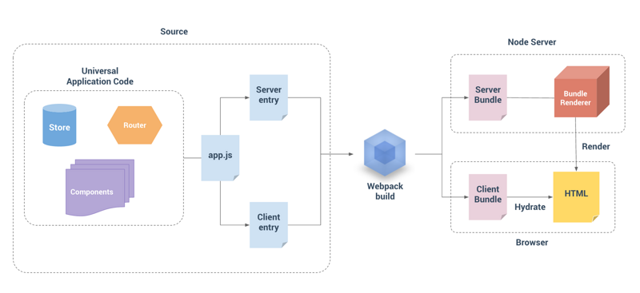

概念：放在浏览器进行就是浏览器渲染,放在服务器进行就是服务器渲染。

- 客户端渲染不利于 SEO 搜索引擎优化
- 服务端渲染是可以被爬虫抓取到的，客户端异步渲染是很难被爬虫抓取到的
- SSR直接将HTML字符串传递给浏览器。大大加快了首屏加载时间。
- SSR占用更多的CPU和内存资源
- 一些常用的浏览器API可能无法正常使用
- 在vue中只支持beforeCreate和created两个生命周期



## [#](http://www.zhufengpeixun.com/advance/vue-analyse/vue-ssr.html#一-开始vue-ssr之旅)一.开始vue-ssr之旅

```text
yarn add vue-server-renderer vue
yarn add koa koa-router
```

createRenderer,创建一个渲染函数 renderToString, 渲染出一个字符串

```javascript
const Vue = require('vue');
const render = require('vue-server-renderer');
const Koa = require('koa');
const Router = require('koa-router');
const app = new Koa();
const router = new Router();
const vm = new Vue({
    data(){
        return {msg:"hello world"}
    },
    template:`<div>{{msg}}</div>`
});
router.get('/',async (ctx)=>{
    let r = await render.createRenderer().renderToString(vm);
    ctx.body = `
    <!DOCTYPE html>
    <html lang="en">
    <head>
        <meta charset="UTF-8">
        <meta name="viewport" content="width=device-width, initial-scale=1.0">
        <meta http-equiv="X-UA-Compatible" content="ie=edge">
        <title>Document</title>
    </head>
    <body>
        ${r}
    </body>
    </html>
    `
});
app.use(router.routes());
app.listen(4000);
```


## [#](http://www.zhufengpeixun.com/advance/vue-analyse/vue-ssr.html#二-采用模板渲染)二.采用模板渲染

```html
<!DOCTYPE html>
<html lang="en">
  <head><title>Hello</title></head>
  <body>
    <!--vue-ssr-outlet-->
  </body>
</html>
```


传入template 替换掉注释标签

```javascript
const Vue = require('vue');
const render = require('vue-server-renderer');
const Koa = require('koa');
const Router = require('koa-router');
const app = new Koa();
const router = new Router();
const vm = new Vue({
    data(){
        return {msg:"hello world"}
    },
    template:`<div>{{msg}}</div>`
});
const template = require('fs').readFileSync('./index.html','utf8');
router.get('/',async (ctx)=>{
    let r = await render.createRenderer({
        template
    }).renderToString(vm);
    ctx.body = r;
});
app.use(router.routes());
app.listen(4000);
```

## [#](http://www.zhufengpeixun.com/advance/vue-analyse/vue-ssr.html#三-ssr目录创建)三.ssr目录创建

```text
├── config
│   ├── webpack.base.js
│   ├── webpack.client.js
│   └── webpack.server.js
├── dist
│   ├── client.bundle.js
│   ├── index.html
│   ├── index.ssr.html
│   ├── server.bundle.js
│   ├── vue-ssr-client-manifest.json
│   └── vue-ssr-server-bundle.json
├── package.json
├── public
│   ├── index.html
│   └── index.ssr.html
├── server.js
├── src
│   ├── App.vue
│   ├── components
│   │   ├── Bar.vue
│   │   └── Foo.vue
│   ├── entry-client.js
│   ├── entry-server.js
│   ├── app.js
│   ├── router.js
│   └── store.js
├── webpack.config.js
```


## [#](http://www.zhufengpeixun.com/advance/vue-analyse/vue-ssr.html#四-通过webpack实现编译vue项目)四.通过webpack实现编译vue项目

安装插件

```text
yarn add webpack webpack-cli webpack-dev-server vue-loader vue-style-loader css-loader html-webpack-plugin @babel/core @babel/preset-env babel-loader vue-template-compiler webpack-merge
```


```javascript
const path = require('path');
const HtmlWebpackPlugin = require('html-webpack-plugin');
const VueLoaderPlugin = require('vue-loader/lib/plugin')
const resolve = (dir)=>{
    return path.resolve(__dirname,dir)
}
module.exports = {
    entry: resolve('./src/client-entry.js'),
    output:{
        filename:'[name].bundle.js',
        path:resolve('dist')
    },
    module:{
        rules:[
            {
                test:/\.css$/,
                use:['vue-style-loader','css-loader']
            },
            {
                test:/\.js$/,
                use:{
                    loader:'babel-loader',
                    options:{
                        presets:['@babel/preset-env']
                    }
                },
                exclude:/node_modules/
            },
            {
                test:/.vue$/,
                use:'vue-loader'
            }
        ]
    },
    plugins:[
        new VueLoaderPlugin(),
        new HtmlWebpackPlugin({
            template:'./index.html'
        })
    ]
}
```


### [#](http://www.zhufengpeixun.com/advance/vue-analyse/vue-ssr.html#app-js)app.js

```javascript
import Vue from "vue";
import App from "./App.vue";
export default () => { // 为了保证实例的唯一性所以导出一个创建实例的函数
  const app = new Vue({
    render: h => h(App)
  });
  return { app };
};
```


### [#](http://www.zhufengpeixun.com/advance/vue-analyse/vue-ssr.html#client-entry-js)client-entry.js

```javascript
import createApp from "./app";
const { app } = createApp();
app.$mount("#app"); // 客户端渲染手动挂载到dom元素上
```


### [#](http://www.zhufengpeixun.com/advance/vue-analyse/vue-ssr.html#server-entry-js)server-entry.js

```javascript
import createApp from "./app";
export default () => {
  const { app } = createApp();
  return app; // 服务端渲染只需将渲染的实例导出即可
};
```


## [#](http://www.zhufengpeixun.com/advance/vue-analyse/vue-ssr.html#五-配置客户端打包和服务端打包)五.配置客户端打包和服务端打包

- webpack.base.js

```javascript
let path = require('path');
let VueLoaderPlugin = require('vue-loader/lib/plugin')
module.exports = {
    output:{
        filename:'[name].bundle.js',
        path:path.resolve(__dirname,'../dist')
    },
    module:{
        rules:[
            {test:/\.css/,use:['vue-style-loader','css-loader']},
            {
                test:/\.js/,
                use:{
                    loader:'babel-loader',
                    options:{
                        presets:['@babel/preset-env']
                     },
                },
                exclude:/node_modules/,
            },
            {test:/\.vue/,use:'vue-loader'}
        ]
    },
    plugins:[
        new VueLoaderPlugin()
    ]
}
```


- webpack.client.js

```javascript
const merge = require("webpack-merge");
const path = require("path");
const HtmlWebpackPlugin = require("html-webpack-plugin");
const base = require("./webpack.base");
const resolve = filepath => {
  return path.resolve(__dirname, filepath);
};
module.exports = merge(base, {
  entry: {
    client: resolve("../src/client-entry.js")
  },
  plugins: [
    new HtmlWebpackPlugin({
      template: resolve("../template/index.client.html")
    })
  ]
});
```


- webpack.server.js

```javascript
const merge = require("webpack-merge");
const path = require("path");
const HtmlWebpackPlugin = require("html-webpack-plugin");
const base = require("./webpack.base");
const resolve = filepath => {
  return path.resolve(__dirname, filepath);
};
module.exports = merge(base, {
  entry: {
    server: resolve("../src/server-entry.js")
  },
  target: "node",
  output: {
    libraryTarget: "commonjs2" // 导出供服务端渲染来使用
  },
  plugins: [
    new HtmlWebpackPlugin({
      filename: "index.ssr.html",
      template: resolve("../template/index.ssr.html"),
      excludeChunks: ["server"]
    })
  ]
});
```


## [#](http://www.zhufengpeixun.com/advance/vue-analyse/vue-ssr.html#六-配置运行脚本)六.配置运行脚本

```json
"scripts": {
    "client:dev": "webpack-dev-server --config ./build/webpack.client.js", // 客户端开发环境
    "client:build": "webpack --config ./build/webpack.client.js", // 客户端打包环境
    "server:build": "webpack --config ./build/webpack.server.js" // 服务端打包环境
 },
```


## [#](http://www.zhufengpeixun.com/advance/vue-analyse/vue-ssr.html#七-服务端配置)七.服务端配置

在App.vue上增加id="app"可以保证元素被正常激活

```javascript
const Koa = require("koa");
const Router = require("koa-router");
const static = require("koa-static");
const path = require("path");
const app = new Koa();
const router = new Router();
const VueServerRenderer = require("vue-server-renderer");
const fs = require("fs");
// 服务端打包的结果
const serverBundle = fs.readFileSync("./dist/server.bundle.js", "utf8");
const template = fs.readFileSync("./dist/index.ssr.html", "utf8");
const render = VueServerRenderer.createBundleRenderer(serverBundle, {
  template
});
router.get("/", async ctx => {
  ctx.body = await new Promise((resolve, reject) => {
    render.renderToString((err, html) => {
      // 必须写成回调函数的方式否则样式不生效
      resolve(html);
    });
  });
});
app.use(router.routes());
app.use(static(path.resolve(__dirname, "dist")));
app.listen(3000);
```


> 在index.ssr.html中需要手动引入客户端打包后的结果

## [#](http://www.zhufengpeixun.com/advance/vue-analyse/vue-ssr.html#七-通过json配置createbundlerenderer方法)七.通过json配置createBundleRenderer方法

实现热更新,自动增加preload和prefetch,以及可以使用sourceMap

```javascript
const VueSSRClientPlugin = require('vue-server-renderer/client-plugin'); // 在客户端打包时增加插件
const VueSSRServerPlugin = require('vue-server-renderer/server-plugin'); // 在服务端打包时增加插件


const Koa = require("koa");
const Router = require("koa-router");
const static = require("koa-static");
const path = require("path");
const app = new Koa();
const router = new Router();
const VueServerRenderer = require("vue-server-renderer");
const fs = require("fs");
// 服务端打包的结果
// const serverBundle = fs.readFileSync("./dist/server.bundle.js", "utf8");
const template = fs.readFileSync("./dist/index.ssr.html", "utf8");
const serverBundle = require("./dist/vue-ssr-server-bundle.json");
const clientManifest = require("./dist/vue-ssr-client-manifest.json");
const render = VueServerRenderer.createBundleRenderer(serverBundle, {
  template,
  clientManifest // 自动注入客户端打包后的文件
});

router.get("/", async ctx => {
  ctx.body = await new Promise((resolve, reject) => {
    render.renderToString((err, html) => {
      // 必须写成回调函数的方式否则样式不生效
      resolve(html);
    });
  });
});
app.use(router.routes());
app.use(static(path.resolve(__dirname, "dist")));
app.listen(3000);
```


## [#](http://www.zhufengpeixun.com/advance/vue-analyse/vue-ssr.html#八-集成vuerouter)八.集成VueRouter

```text
yarn add vue-router
```

1

```javascript
import Vue from "vue";
import VueRouter from "vue-router";
import Foo from "./components/Foo.vue";
Vue.use(VueRouter);
export default () => {
  const router = new VueRouter({
    mode: "history",
    routes: [
      { path: "/", component: Foo },
      { path: "/bar", component: () => import("./components/Bar.vue") }
    ]
  });
  return router;
};
```


> 导出路由配置

### [#](http://www.zhufengpeixun.com/advance/vue-analyse/vue-ssr.html#配置入口文件)配置入口文件

```javascript
import Vue from "vue";
import App from "./App.vue";
import createRouter from "./router";
export default () => {
  const router = createRouter();
  const app = new Vue({
    router,
    render: h => h(App)
  });
  return { app, router };
};
```


### [#](http://www.zhufengpeixun.com/advance/vue-analyse/vue-ssr.html#配置组件信息)配置组件信息

```javascript
<template>
    <div id="app">
        <router-link to="/"> foo</router-link>
        <router-link to="/bar"> bar</router-link>
        <router-view></router-view>
    </div>
</template>
```


### [#](http://www.zhufengpeixun.com/advance/vue-analyse/vue-ssr.html#防止刷新页面不存在)防止刷新页面不存在

```javascript
router.get("*", async ctx => {
  ctx.body = await new Promise((resolve, reject) => {
    render.renderToString({ url: ctx.url }, (err, html) => {
      // 必须写成回调函数的方式否则样式不生效
      resolve(html);
    });
  });
});
```

1
2
3
4
5
6
7
8

### [#](http://www.zhufengpeixun.com/advance/vue-analyse/vue-ssr.html#保证异步路由加载完成)保证异步路由加载完成

```javascript
export default ({ url }) => {
  return new Promise((resolve, reject) => {
    const { app, router } = createApp();
    router.push(url);
    router.onReady(() => {
      const matchComponents = router.getMatchedComponents();
      if (!matchComponents.length) {
        return reject({ code: 404 });
      }
      resolve(app);
    }, reject);
  });
};

// 服务器可以监控到错误信息，返回404
render.renderToString({ url: ctx.url }, (err, html) => {
      // 必须写成回调函数的方式否则样式不生效
    if (err && err.code == 404) {
    resolve("404 Not Found");
    }
    resolve(html);
});
```

## [#](http://www.zhufengpeixun.com/advance/vue-analyse/vue-ssr.html#十-集成vuex配置)十.集成vuex配置

```text
yarn add vuex
```

1

```javascript
import Vue from 'vue';
import Vuex from 'vuex';
Vue.use(Vuex);

export default ()=>{
    let store = new Vuex.Store({
        state:{
            username:'song'
        },
        mutations:{
            changeName(state){
                state.username = 'hello';
            }
        },
        actions:{
            changeName({commit}){
                return new Promise((resolve,reject)=>{
                    setTimeout(() => {
                        commit('changeName');
                        resolve();
                    }, 1000);
                })
            }
        }
    });
    return store
}
```


```js
// 引用vuex
import createRouter from './router';
import createStore from './store'
export default ()=>{
    let router = createRouter();
    let store = createStore();
    let app = new Vue({
        router,
        store,
        render:(h)=>h(App)
    })
    return {app,router,store}
}
```


### [#](http://www.zhufengpeixun.com/advance/vue-analyse/vue-ssr.html#在后端更新vuex)在后端更新vuex

```javascript
import createApp from './main';
export default (context)=>{
    return new Promise((resolve)=>{
        let {app,router,store} = createApp();
        router.push(context.url); // 默认访问到/a就跳转到/a
        router.onReady(()=>{
            let matchComponents = router.getMatchedComponents(); // 获取路由匹配到的组件
            
            Promise.all(matchComponents.map(component=>{
                if(component.asyncData){
                    return component.asyncData(store);
                }
            })).then(()=>{
                context.state = store.state; // 将store挂载在window.__INITIAL_STATE__
                resolve(app);

            });
        })
    })
}
```


### [#](http://www.zhufengpeixun.com/advance/vue-analyse/vue-ssr.html#在浏览器运行时替换store)在浏览器运行时替换store

```javascript
// 在浏览器运行代码
if(typeof window !== 'undefined' && window.__INITIAL_STATE__){
    store.replaceState(window.__INITIAL_STATE__);
}
```

### [#](http://www.zhufengpeixun.com/advance/vue-analyse/vue-ssr.html#需要执行的钩子函数)需要执行的钩子函数

```javascript
export default {
 mounted() {
  return this.$store.dispatch("changeName");
 },
 asyncData(store) {
  return store.dispatch("changeName");
 }
};
```